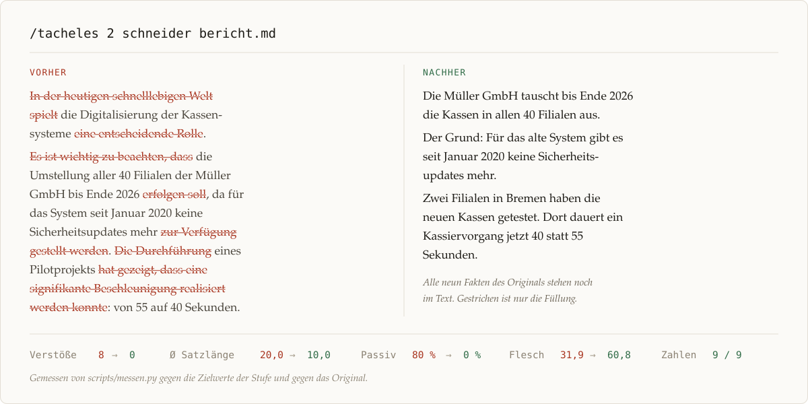

<div align="center">

# tacheles

**Redigiert deutsche Texte wie ein erfahrener Redakteur. Slop raus, Substanz bleibt.**

Ein Skill für [Claude Code](https://claude.com/claude-code). Die Dichte wählt eine Zahl von 1 bis 5,
die Stimme wahlweise ein Name: Wolf Schneider, Kästner, Tucholsky, Kisch, Kafka, Fontane, Mann, Bernhard.
Ob das Ergebnis hält, was es verspricht, misst ein Skript nach.

[](https://github.com/ur-grue/tacheles/actions/workflows/tests.yml)
[](LICENSE)
[](https://code.claude.com/docs/en/plugins)
[](skills/tacheles/scripts/messen.py)

</div>



```
/tacheles 2 bericht.md
/tacheles 4 tucholsky
/tacheles 1 Die Umsetzung der Maßnahmen erfolgt zeitnah …
```

## Warum

Wer Slop mit einem Prompt bekämpft, bekommt meistens zwei Ergebnisse. Das Modell streicht so lange, bis aus „Wir empfehlen Anbieter A, weil nur er die Daten im Haus behält“ ein „Wir empfehlen Anbieter A“ geworden ist. Die Floskeln wiederum ersetzt es durch neue. Tacheles geht den umgekehrten Weg: Erst notiert es, was der Text an Zahlen, Namen und Begründungen enthält, dann schreibt es um, am Ende prüft es, ob alles noch dasteht. Kürzer wird der Text dabei meistens. Darauf zielt das Verfahren aber nicht.

Dazu kommt der zweite Punkt: Floskelfreiheit allein reicht nicht. Ein Text kann jedes Buzzword vermeiden und trotzdem nach Maschine klingen. Das passiert, wenn alle Sätze mit dem Subjekt beginnen, alle gleich lang sind und nur gereiht statt verkettet. Und wenn niemand darin einen Standpunkt hat. Genau da setzt die zweite Prüfung an, mit den Mitteln der deutschen Stilistik und den Befunden der Forschung zu KI-Texten.

## Installation

Als Plugin, in Claude Code:

```
/plugin marketplace add ur-grue/tacheles
/plugin install tacheles@tacheles
```

Von Hand: den Ordner `skills/tacheles` nach `~/.claude/skills/tacheles` kopieren, dann steht er in allen Projekten bereit. Nach `.claude/skills/tacheles` kopiert, gilt er nur im jeweiligen Projekt.

Das Messskript braucht Python 3 und keine Pakete.

## Die fünf Stufen

| Stufe | | Vorbild | Satzlänge Ø | Kennzeichen |
|---|---|---|---|---|
| 1 | einfach | Einfache Sprache (B1) | 6–10 Wörter | ein Gedanke je Satz, kein Passiv, kein Fachwort ohne Erklärung |
| 2 | klar | Nachrichtenagentur, Wolf Schneider | 9–14 | Hauptsache im Hauptsatz, ein Nebensatz höchstens, Verben statt Substantive |
| 3 | sachlich | Zeit, FAZ, gutes Sachbuch | 12–17 | Nebensätze, wo sie Logik tragen; Fachbegriffe konsistent |
| 4 | ausführlich | Essay, Analyse | 15–21 | Herleitung und Gegenargument ausformuliert, Perioden erlaubt |
| 5 | elaboriert | literarische Prosa, Festrede | 18–30 | Rhythmus, Parenthesen, präzise Fremdwörter; kein Wort ohne Arbeit |

Die Stufe ist keine Länge: Stufe 1 wird oft länger als Stufe 3, weil sie erklärt, und Stufe 5 baut lange Sätze, keine leeren. Die Zielwerte stammen aus DIN SPEC 33429, den Regeln für Einfache Sprache, der dpa-Faustregel, der Klartext-Initiative Hohenheim und Messungen deutscher Medien.

## Die acht Stile

| Name | Autor | Stufen | Was man hört |
|---|---|---|---|
| `schneider` | Wolf Schneider | 1–3 | Verben, Einsilber, Hauptsätze, Konkretes. Das Handwerk in Reinform. |
| `kaestner` | Erich Kästner | 1–3 | Klar, warm, leise ironisch. Sagt schwere Dinge einfach. |
| `tucholsky` | Kurt Tucholsky | 2–4 | Hauptsätze, Anrede, Pointe, Zorn mit Witz. |
| `kisch` | Egon Erwin Kisch | 2–4 | Reportage: Präsens, Szene statt Behauptung, eine Leitmetapher. |
| `kafka` | Franz Kafka | 3–4 | Nüchterne Präzision, lange lineare Sätze, Kanzleisprache ohne Kanzleigeist. |
| `fontane` | Theodor Fontane | 3–4 | Plauderton, „aber“-Urteile, das Beiläufige trägt die Pointe. |
| `mann` | Thomas Mann | 4–5 | Ironische Perioden, Parenthesen, Leitmotiv, Feierlichkeit leicht unterlaufen. |
| `bernhard` | Thomas Bernhard | 4–5 | Wiederholung, Übertreibung, der eine lange Atemzug. Für Polemik. |

Jedes Profil hat operationale Regeln, belegt aus Stilanalysen, dazu Karikatur-Fallen und eine Probe an derselben Vorlage. Ein Stil darf zuspitzen, was im Text steht; er erfindet keine Fakten, keine Gegner, keine Zitate.

Dieselbe Vorlage, drei Fassungen:

> **Vorlage.** In der heutigen schnelllebigen Welt spielt die Digitalisierung der Kassensysteme eine entscheidende Rolle. Es ist wichtig zu beachten, dass die Umstellung aller 40 Filialen der Müller GmbH bis Ende 2026 erfolgen soll, da für das bestehende System seit Januar 2020 keine Sicherheitsupdates mehr zur Verfügung gestellt werden. Die Durchführung eines Pilotprojekts in zwei Bremer Filialen hat gezeigt, dass eine signifikante Beschleunigung des Kassiervorgangs von 55 auf 40 Sekunden realisiert werden konnte. Die Investition von rund 1,2 Millionen Euro wurde seitens der Geschäftsführung freigegeben – ein wichtiger Schritt in Richtung Zukunft. Nicht zuletzt ist hervorzuheben, dass kein Stellenabbau erfolgt, sondern frei werdende Mitarbeiter in die Kundenberatung integriert werden.

> **Stufe 3, Stil `tucholsky`.** Die Müller GmbH kauft neue Kassen. Vierzig Filialen, bis Ende 2026, 1,2 Millionen Euro. Man könnte das eine Investition nennen; es ist eine Reparatur. Das alte System bekommt seit Januar 2020 keine Sicherheitsupdates mehr, und wer sechs Jahre lang mit einer Kasse arbeitet, die niemand mehr schützt, der hat nicht gespart, der hat gewartet. Nun also Bremen: Zwei Filialen haben die neuen Geräte ausprobiert, und siehe da, das Kassieren dauert 40 Sekunden statt 55. Fünfzehn Sekunden. Das klingt nach wenig; zählen Sie das mal an einem Samstag zusammen. Und die Menschen? Niemand fliegt. Wer an der Kasse frei wird, berät Kunden. Das ist das Richtige.

> **Stufe 5, ohne Stil.** Dass die Müller GmbH bis Ende 2026 sämtliche 40 Filialen mit neuen Kassen ausstattet, hat einen schlichten Grund: Seit Januar 2020 erhält das bisherige System keine Sicherheitsupdates mehr, und ein Kassensystem, dessen Lücken niemand mehr schließt, ist mit jedem Tag etwas weniger Werkzeug und etwas mehr Risiko. Das freundlichere Argument lieferte der Pilotversuch nach: In zwei Bremer Filialen dauert ein Kassiervorgang seither 40 statt 55 Sekunden. Rund 1,2 Millionen Euro hat die Geschäftsführung dafür freigegeben. Sie hat zugleich festgelegt, was mit den Menschen geschieht, die die Technik an der Kasse entbehrlich macht, und diese Festlegung ist so knapp wie eindeutig: Niemand verliert seine Stelle; wer dort frei wird, geht in die Kundenberatung.

Alle neun Fakten der Vorlage stehen in jeder Fassung. Die Proben für alle Stufen und Stile liegen in [`references/stufen.md`](skills/tacheles/references/stufen.md) und [`references/stile/`](skills/tacheles/references/stile/).

## Wie es zuverlässig wird

Drei Dinge unterscheiden das Skill von einem gewöhnlichen Anti-Slop-Prompt.

**Das Inventar.** Vor dem ersten neuen Satz listet der Redakteur die Substanz des Originals: Zahlen, Namen, Zitate, Begründungen, Beispiele, Einschränkungen, Wertungen des Autors. Nach dem Umschreiben geht er die Liste durch. Fehlt etwas, kommt es zurück, auch wenn der Text dadurch länger wird.

**Die Stilistik.** [`references/stilistik.md`](skills/tacheles/references/stilistik.md) bringt die deutsche Stilistik und Textlinguistik mit der Forschung zu KI-Texten zusammen: thematische Progression nach Daneš, Vorfeldbesetzung, Wiederaufnahme statt Konnektoren, Behaghels Gesetze, Bildfelder nach Weinrich. Daraus entstehen vierzehn Prinzipien mit Arbeitsanweisungen und eine Prüfliste aus acht Fragen. Was die einzelne Textsorte verlangt, steht in [`references/textsorten.md`](skills/tacheles/references/textsorten.md): Nachricht, Bericht, Reportage, Kommentar, Glosse. Belegt ist jede Regel: mit den Hausregeln von dpa und Spiegel, mit Passagen aus preisgekrönten Texten.

**Die Messung.** [`scripts/messen.py`](skills/tacheles/scripts/messen.py) prüft das Ergebnis gegen die Stufe und gegen das Original:

```
TACHELES · Messung · Stufe 3 (sachlich)
Wörter 100 · Sätze 5 · Absätze 1
Satzlänge  Ø 20.0 · Median 17 · längster 31   (Ziel Ø 12–17, kein Satz über 30)
Lesbarkeit Flesch-Amstad 31.9 (Ziel ≥ 40) · Wiener Sachtextformel 12.6 · LIX 61.0
Passiv 4 Sätze (80 %, max 15 %) · Nominalisierungen 7 (7.0/100, max 4.0) · Streckverben 2

VERSTÖSSE (8)
  ✗ Satz 2 hat 31 Wörter (Stufe 3: höchstens 30)
  ✗ Einstiegsfloskeln: „in der heutigen … welt“ [Satz 1]
  ✗ Metakommentare: „es ist wichtig zu beachten“ [Satz 2]
  ✗ Passiv in 4 von 5 Sätzen (80 %, Stufe 3: höchstens 15 %)
  ✗ 7 Nominalisierungen (7.0 je 100 Wörter): Beschleunigung, Digitalisierung, Durchführung …
  ✗ 2 Streckverben (zur Verfügung gestellt, erfolgt)
  …
```

Das Skript misst Satzlängen, Flesch-Amstad, Wiener Sachtextformel, LIX, Passiv, Nominalstil, Streckverben, Verbklammern, rund 725 Floskeln und Struktur-Tells wie Gedankenstrich-Inflation, Fazit-Absätze oder Überschriften als Frage. Dazu kommen vier Stilistik-Befunde: Anteil der Sätze mit Subjekt im Vorfeld, Streuung der Satzlängen, additive Konnektoren am Satzanfang und unbelebte Subjekte mit Verben der Absicht („Die Studie fordert“). Mit `--vergleich original.txt` prüft das Skript, ob Zahlen, Zitate, Adressen und Namen noch da sind und ob der Text unter 60 Prozent der Originallänge gefallen ist. Verstöße bessert das Skill nach; über Hinweise entscheidet der Redakteur.

Die Floskelliste ist geteilt: Was nie Information trägt, ist ein Verstoß. Was im Kontext richtig sein kann, etwa „nachhaltig“ als ökologischer Begriff oder ein einzelnes „zudem“, ist ein Hinweis. Sie stützt sich auf die Wikipedia-Projektseiten zu KI-Texten, deutsche Lektoratslisten und die beiden empirischen Studien zu deutschen KI-Texten (Juzek 2026; Irrgang u. a. 2024).

## Was es nicht tut

- Es kürzt nicht auf Quote. Ein Ergebnis unter 60 Prozent der Originallänge gilt als verdächtig.
- Es erfindet nichts. Fehlt ein Wert, steht `[PRÜFEN: …]` an seiner Stelle.
- Es übersetzt nicht. Etablierte Fachbegriffe bleiben stehen.
- Es karikiert keinen Autor. Ein Stil ist Satzbau und Haltung, keine Sammlung von Manierismen.
- Es formatiert nicht auf: keine Emoji, keine Fettwüsten, keine Überschriften als Frage.

## Aufbau

```
skills/tacheles/
├── SKILL.md                  Verfahren, Parameter, Grundgesetz
├── scripts/messen.py         Messung und Substanzabgleich (nur Standardbibliothek)
└── references/
    ├── stufen.md             die fünf Stufen mit Zielwerten und Proben
    ├── redakteur.md          das Handwerk: Engel, Reiners, Schneider, Schopenhauer, Nietzsche, Tucholsky, Kraus
    ├── stilistik.md          der Text als Ganzes: Verkettung, Vorfeld, Streuung, Konkretion, Standpunkt
    ├── textsorten.md         Nachricht, Reportage, Kommentar, Glosse: Hausregeln und belegte Beispiele
    ├── slop.md               die Strukturmuster und ihre Gegenstrategien
    ├── floskeln.txt          die Wortliste, gemeinsame Quelle für Skill und Skript
    ├── probe.md              die Vorlage, an der alle Stufen und Stile gezeigt werden
    └── stile/                acht Stilprofile
tests/                        43 Tests, ohne Abhängigkeiten
```

## Das Messskript allein benutzen

```bash
python3 skills/tacheles/scripts/messen.py --stufe 2 text.md
python3 skills/tacheles/scripts/messen.py --stufe 4 --stil fontane neu.md --vergleich alt.md
python3 skills/tacheles/scripts/messen.py --json text.md
```

Der Rückgabewert ist 0 ohne Verstöße und 1 mit Verstößen; so lässt es sich in einen Git-Hook hängen oder in eine CI. Alle Werte sind Heuristiken ohne Wörterbuch; das Skript ersetzt keinen Redakteur, es zeigt ihm, wo er hinsehen muss.

## Einen eigenen Stil ergänzen

Ein Stilprofil ist eine Markdown-Datei in `references/stile/`. Der Kopf enthält die Messschwellen, der Körper die Regeln:

```markdown
---
name: rilke
titel: Rainer Maria Rilke
stufen: 4-5
satz_avg: 14–24
satz_max: 42
passiv: 0.15
nominal: 4.0
---

# Rainer Maria Rilke – …

Zwei Absätze: Wie klingt der Stil, und wofür taugt er?

## Regeln
## Karikatur-Fallen
## Probe
## Quellen
```

Die Schwellen im Kopf haben Vorrang vor denen der Stufe; das Skript übernimmt sie mit `--stil rilke`. Wichtig sind die Karikatur-Fallen: Sie verhindern, dass aus dem Stil eine Parodie wird. Belege für die Regeln gehören unter Quellen, damit nachprüfbar bleibt, warum eine Regel dasteht. Die Tests prüfen jedes neue Profil auf Aufbau und plausible Schwellen:

```bash
python3 -m unittest discover -s tests
```

## Quellen

**Stillehren.** Wolf Schneider, *Deutsch für Profis*, *Deutsch fürs Leben*, *Deutsch für junge Profis* · Eduard Engel, *Deutsche Stilkunst* · Ludwig Reiners, *Stilkunst* · Arthur Schopenhauer, *Über Schriftstellerei und Stil* · Friedrich Nietzsche, *Zur Lehre vom Stil* · Kurt Tucholsky, *Ratschläge für einen schlechten Redner* · Peter Linden, *Duden Handbuch Stilsicher schreiben*.

**Stilistik und Textlinguistik.** Hans-Werner Eroms, *Stil und Stilistik* · Barbara Sandig, *Textstilistik des Deutschen* · Klaus Brinker, *Linguistische Textanalyse* · František Daneš zur thematischen Progression · Otto Behaghel, *Deutsche Syntax* · Harald Weinrich zum Bildfeld.

**Journalismus.** Spiegel-Standards · dpa-Handbuch · Reporter-Forum, Jurybegründungen und Fragebögen.

**Verständlichkeit.** Langer, Schulz von Thun, Tausch, *Sich verständlich ausdrücken* · DIN SPEC 33429 · Netzwerk Leichte Sprache · Klartext-Initiative der Universität Hohenheim · Bundesverwaltungsamt, *Bürgernahe Verwaltungssprache* · Amstad 1978 · Bamberger und Vanecek 1984 zur Wiener Sachtextformel · Björnsson zum LIX.

**Forschung zu KI-Texten.** Reinhart u. a. 2025, *Do LLMs write like humans?* · Yang u. a. 2024 zur thematischen Progression in KI-Texten · Juzek 2026, *AI-Associated Lexical Shifts Across 34 Languages* · Irrgang u. a. 2024, *Features and Detectability of German Texts Generated with LLMs* · Wikipedia, *Anzeichen für KI-generierte Inhalte*.

**Zu einzelnen Stilen.** Blomqvist 2004, *Der Fontane-Ton* · Milan Kundera, *Verratene Vermächtnisse*, zu Kafka.

Was sich nicht belegen ließ, ist in den Referenzdateien als unsicher markiert.

## Lizenz

MIT
